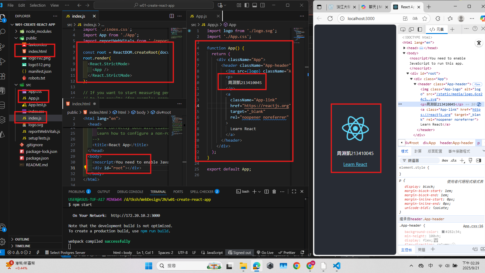
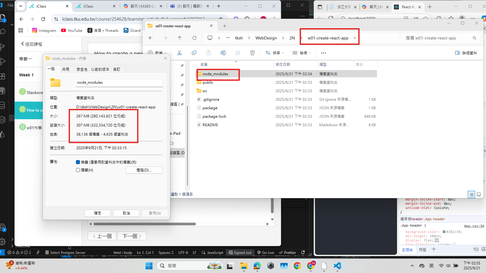
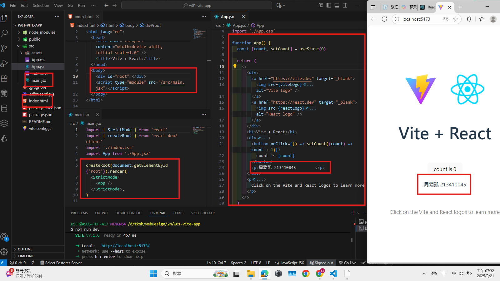
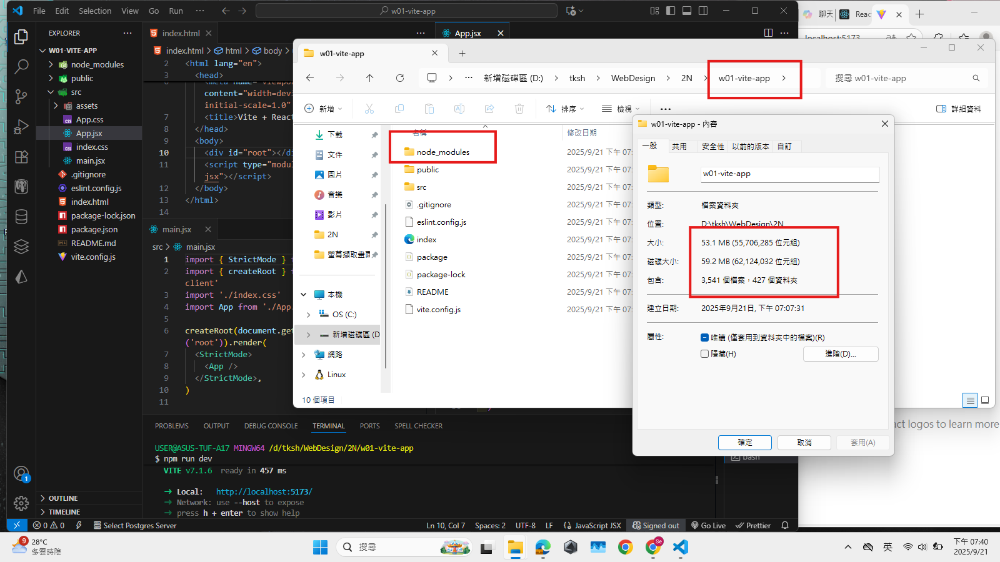
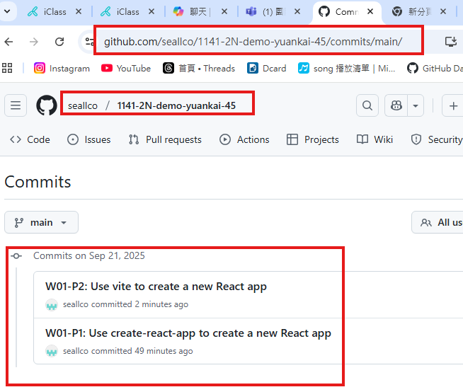
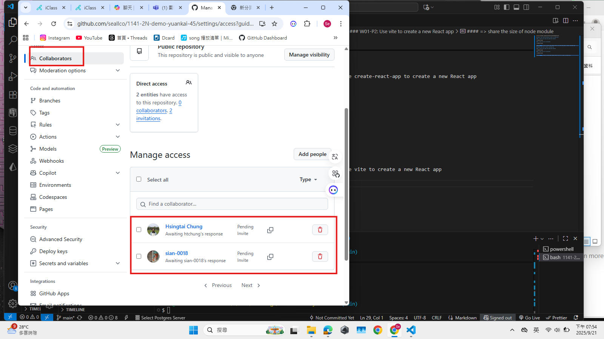

[Github URL](https://github.com/seallco/1141-2N-demo-45.git)

### W01-P1: Use create-react-app to create a new React app
 
#### => show how the index.html page being rendered
 

 
#### => share the size of node module
 

 
```
62b51f9 seallco Sun Sep 21 18:59:22 2025 +0800  W01-P1: Use create-react-app to create a new React app
```
### W01-P2: Use vite to create a new React app
 
#### => show how the index.html page being rendered
 

 
#### => share the size of node module
 

 
```
37f76cb seallco Sun Sep 21 19:46:05 2025 +0800  W01-P2: Use vite to create a new React app
```
### W01-logs: git logs of W01 and share to htchung@gms.tku.edu.tw (teacher) and sian-0018 (TA)
 

 


```
d7151a3 seallco Sun Sep 21 19:57:23 2025 +0800  W01-logs: git logs of W01 and share to htchung@gms.tku.edu.tw (teacher) and sian-0018 (TA)
```
