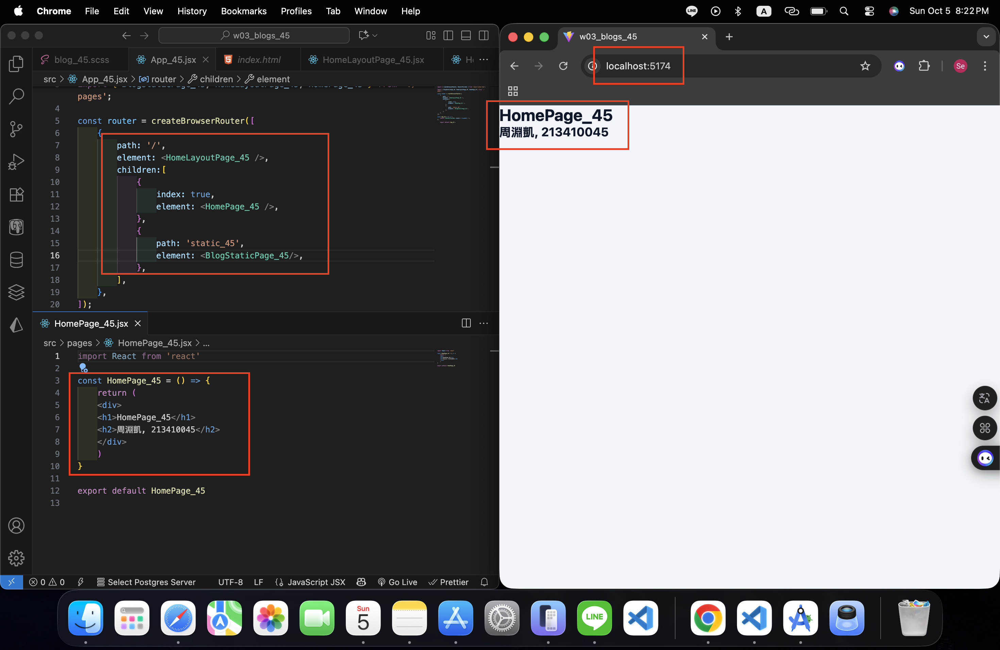
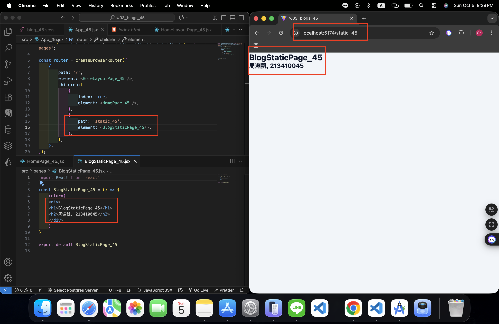

[Github URL](https://github.com/seallco/1141-2N-demo-45.git)

### W03-P1: Create router in App_45.jsx
 
#### => route / for HomePage_45
 

 
#### => route /static_45 for BlogStaticPage_45
 

 
```
268b4cb htchung Wed Oct 1 19:12:14 2025 +0800   W03-P1: Create router in App_xx.jsx
```

### W02-P2: refine code in W01-P1
 
#### => Chrome demo use React DevTools
 


 
```
13ab089 seallco Sun Sep 28 19:59:25 2025 +0800  W02-P2: refine code in W01-P1
```
