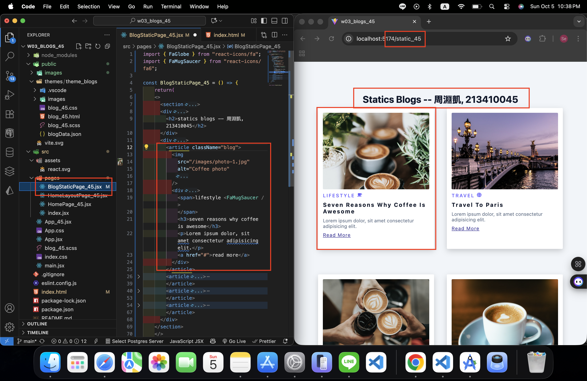

[Github URL](https://github.com/seallco/1141-2N-demo-45.git)

### W03-P1: Create router in App_45.jsx
 
#### => route / for HomePage_45
 

 
#### => route /static_45 for BlogStaticPage_45
 

 
```
16ca976 seallco Sun Oct 5 20:39:12 2025 +0800   W03-P1: Create router in App_45.jsx
```

### W03-P2: Implement route /static_45 for BlogStaticPage_45
 

 
```
b9c7313 htchung Wed Oct 1 19:43:52 2025 +0800   W03-P2: Implement route /static_xx for BlogStaticPage_xx
```
