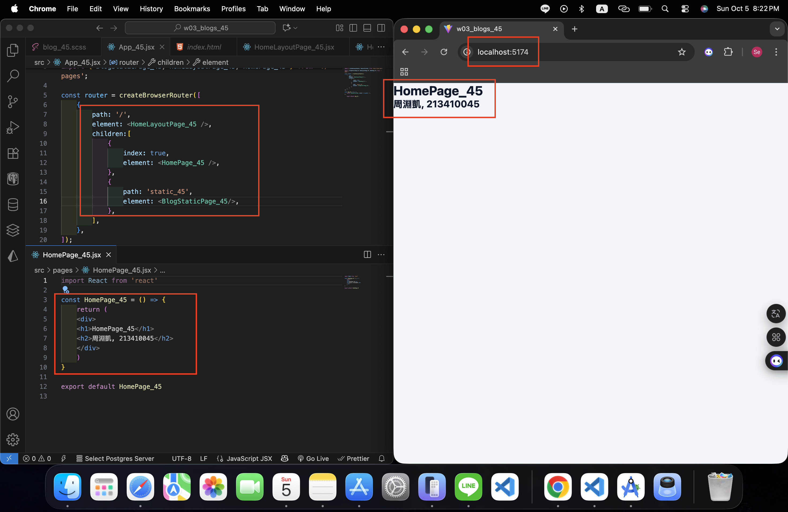
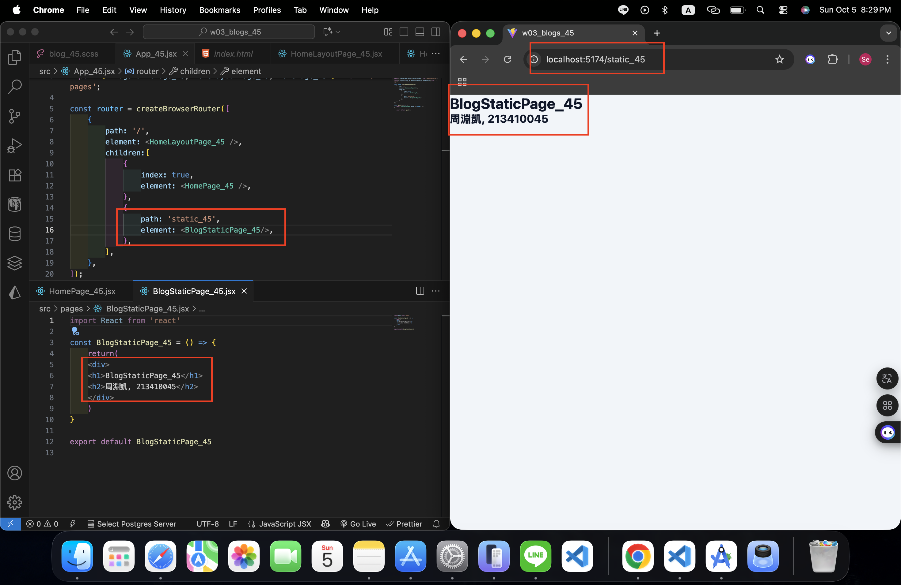
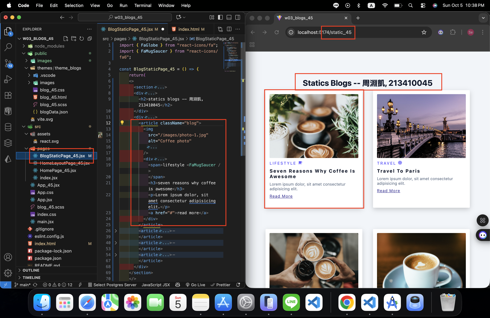
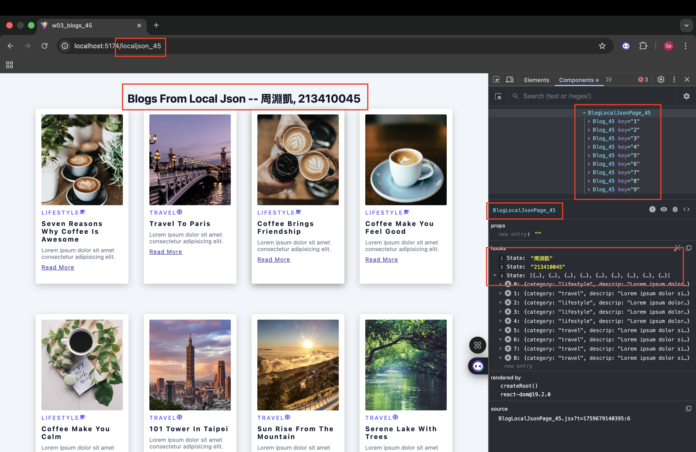
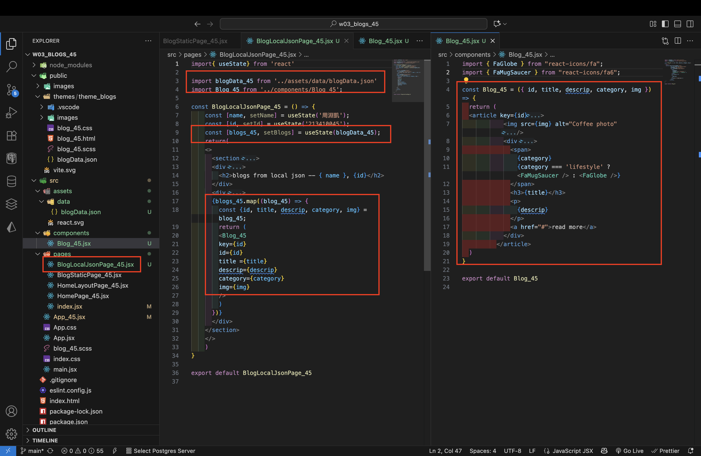

[Github URL](https://github.com/seallco/1141-2N-demo-45.git)

### W03-P1: Create router in App_45.jsx
 
#### => route / for HomePage_45
 

 
#### => route /static_45 for BlogStaticPage_45
 

 
```
16ca976 seallco Sun Oct 5 20:39:12 2025 +0800   W03-P1: Create router in App_45.jsx
```

### W03-P2: Implement route /static_45 for BlogStaticPage_45
 

 
```
fb5e856 seallco Sun Oct 5 22:42:01 2025 +0800   W03-P2: Implement route /static_45 for BlogStaticPage_45
```

### W03-P3: Implement route /localjson_45 by showing blogs from local json
 
#### => Chrome demo using React DevTools
 

 
#### => code for BlogLocalJson_45
 

 
```
af0ef8a seallco Sun Oct 5 23:52:44 2025 +0800   W03-P3: Implement route /localjson_45 by showing blogs from local json
```