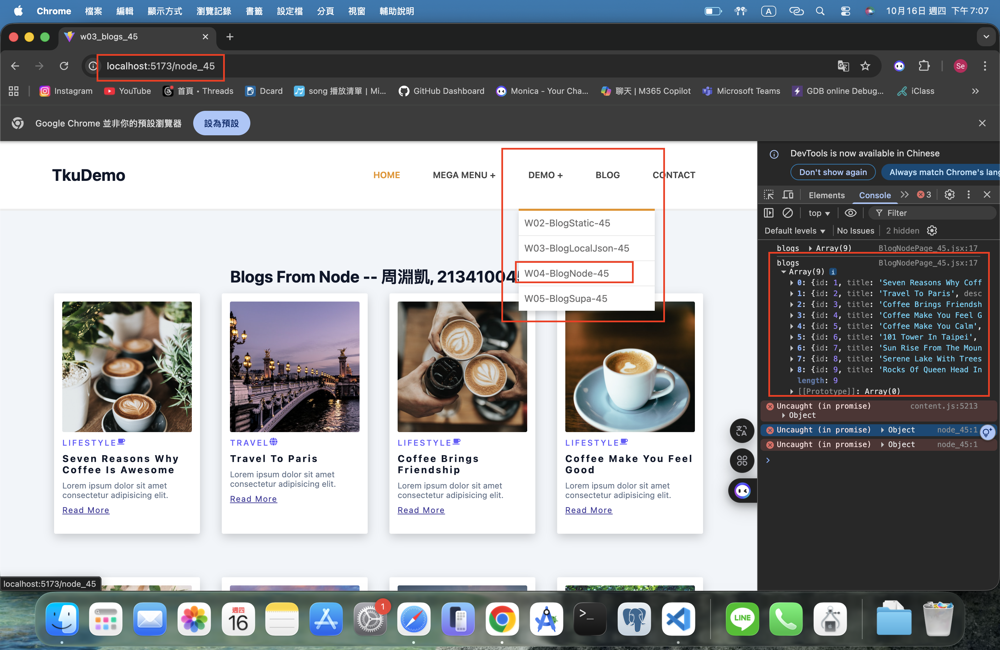
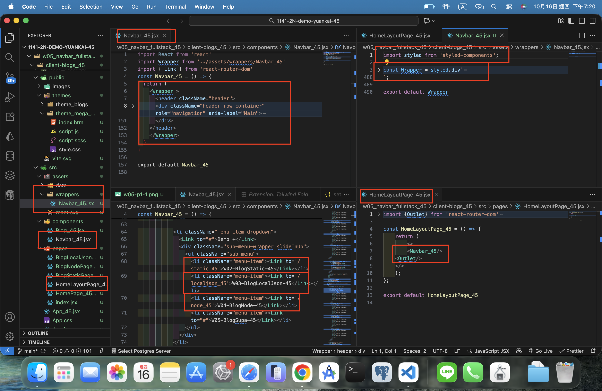
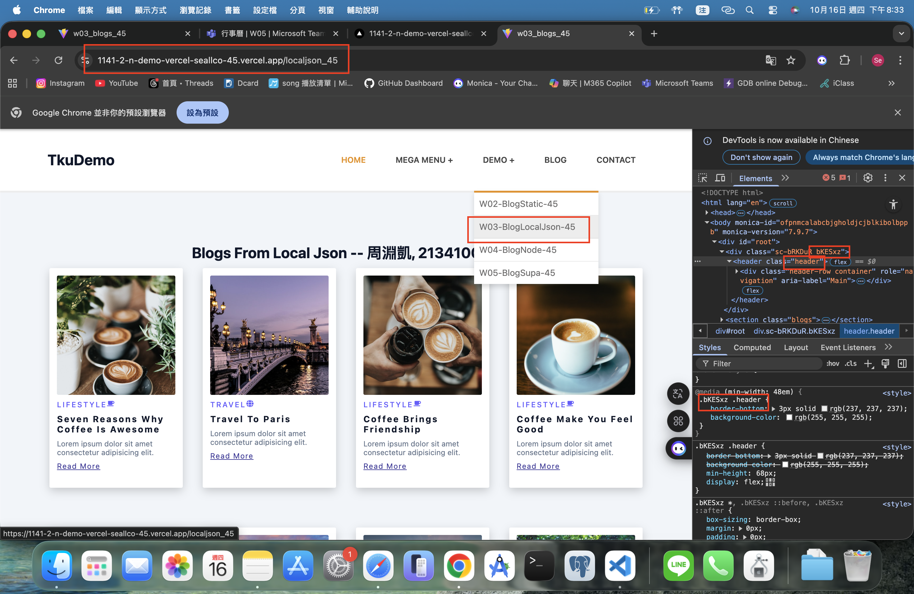
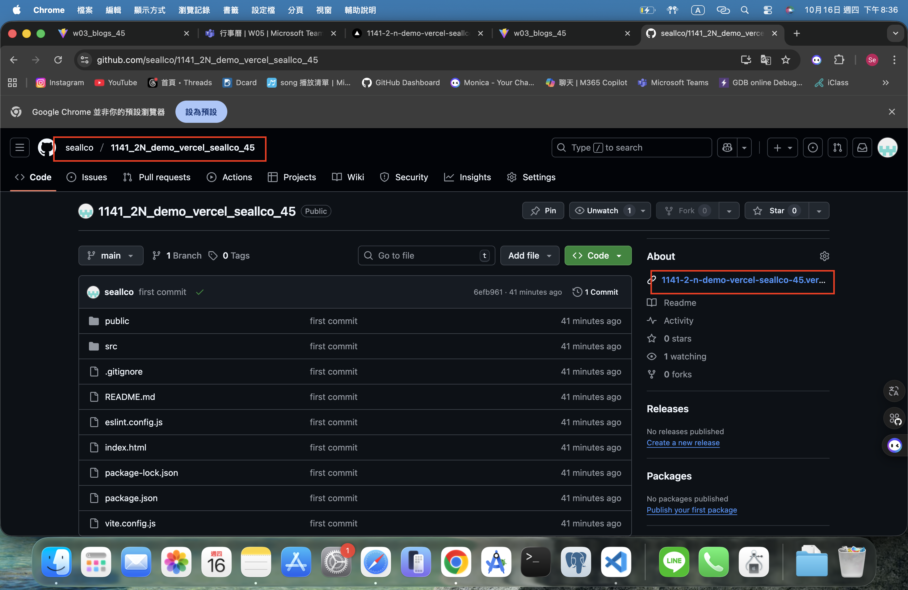

[Github URL](https://github.com/seallco/1141-2N-demo-45.git)

### W05-P1: Create Navbar_45 using styled components, and show BlogNodePage_45
 
##### => Chrome
 

 
##### => relevant code
 

 
```
48f4b7f htchung Wed Oct 15 19:09:57 2025 +0800  W05-P1: Create Navbar_xx using styled components, and show BlogNodePage_xx
```

### W05-P2: Deploy the code to Vercel
 
#### => Show BlogLocalJson in Vercel
 

 
#### => Github repo with Vercel link
 

 
#### => Github demo_vecel repo and Vercel URL
 
[Github URL for Vercel](https://github.com/seallco/1141_2N_demo_vercel_seallco_45)
[Vercel URL](https://1141-2-n-demo-vercel-seallco-45.vercel.app)
 
```
9527456 htchung Wed Oct 15 19:51:18 2025 +0800  W05-P2: Deploy the code to Vercel
```

### W04-P3: from client side to get json data from Node
 
#### => modified client and server code
 

 
#### => Chrome, show 3 blogs
 

 
```
beeba77 ZHOU    Sun Oct 12 18:27:02 2025 +0800  W04-P3: from client side to get json data from Node
```