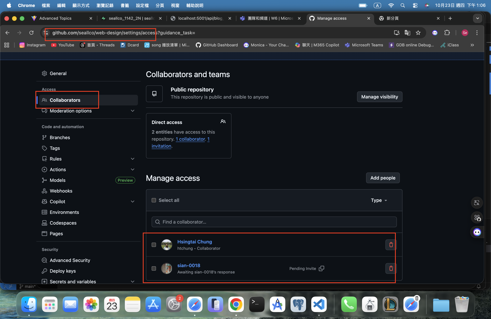
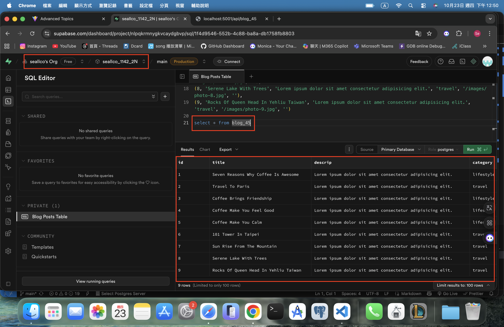
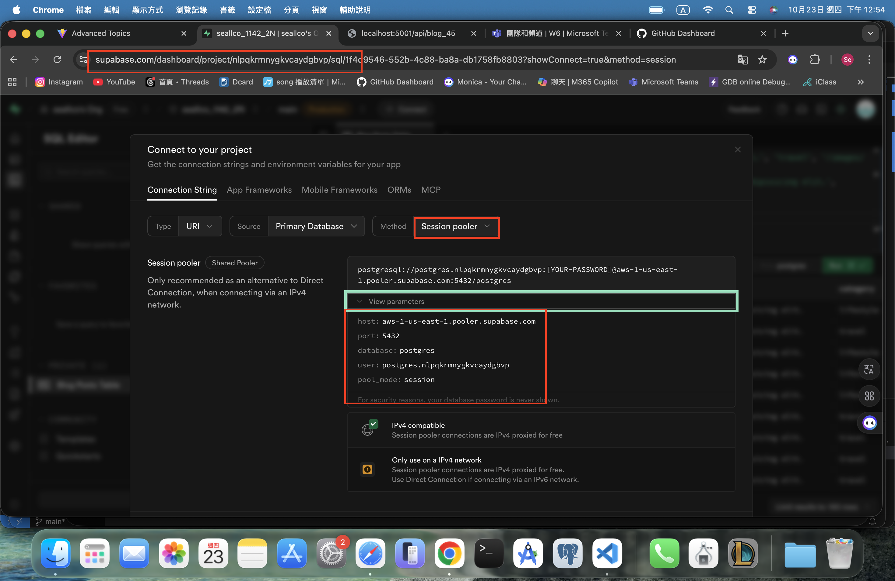
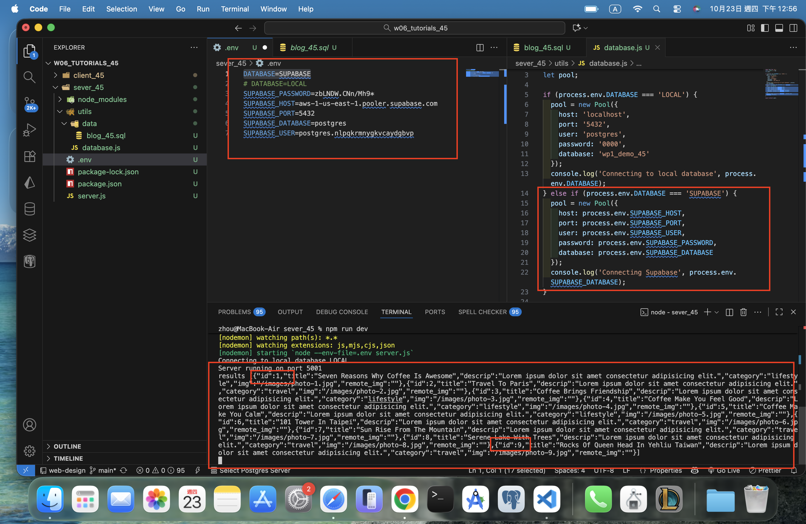
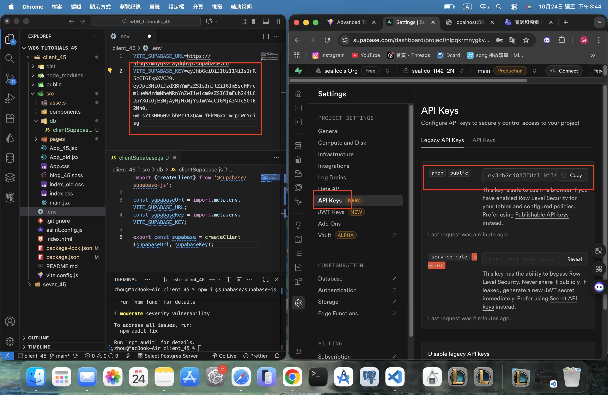
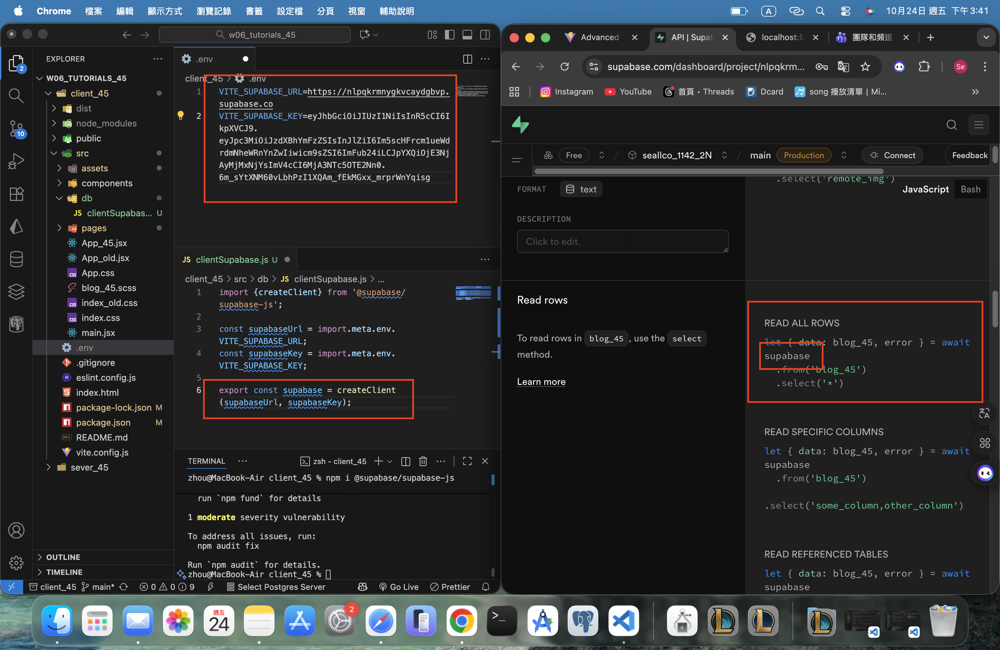

[Github URL](https://github.com/seallco/1141-2N-demo-45.git)

### W06-P1: share URL of Github demo Vercel
 

 
```
36bbe52 seallco Thu Oct 23 13:11:21 2025 +0800  W06-P1: share URL of Github demo Vercel  W06-P2: Supabase settings in Node.js, can connect to Supabase to get 9 blogs data
```

### W06-P2: Supabase settings in Node.js, can connect to Supabase to get 9 blogs data
 
#### => able to get 9 blogs data in Supabase
 

 
#### => connect parameters in Supabase
 

 
#### => server code in Supabase setting
 

 
```
36bbe52 seallco Thu Oct 23 13:11:21 2025 +0800  W06-P1: share URL of Github demo Vercel  W06-P2: Supabase settings in Node.js, can connect to Supabase to get 9 blogs data
```

### W06-P3: Use Supabase client to get 9 blogs data
 
#### => show API keys in Supabase
 

 
#### => Supabase client code
 

 
#### => Use BlogSupaPage_45.jsx to get blogs data from Supabase
 

 
```
0aaee43 htchung Wed Oct 22 20:05:49 2025 +0800  W06-P3: Use Supabase client to get 9 blogs data
```

### W05-P4: Show BookListPage_45 using styled components
 

 
```
4ff05b5 htchung Wed Oct 15 21:03:27 2025 +0800  W05-P4: Show BookListPage_xx using styled components
```