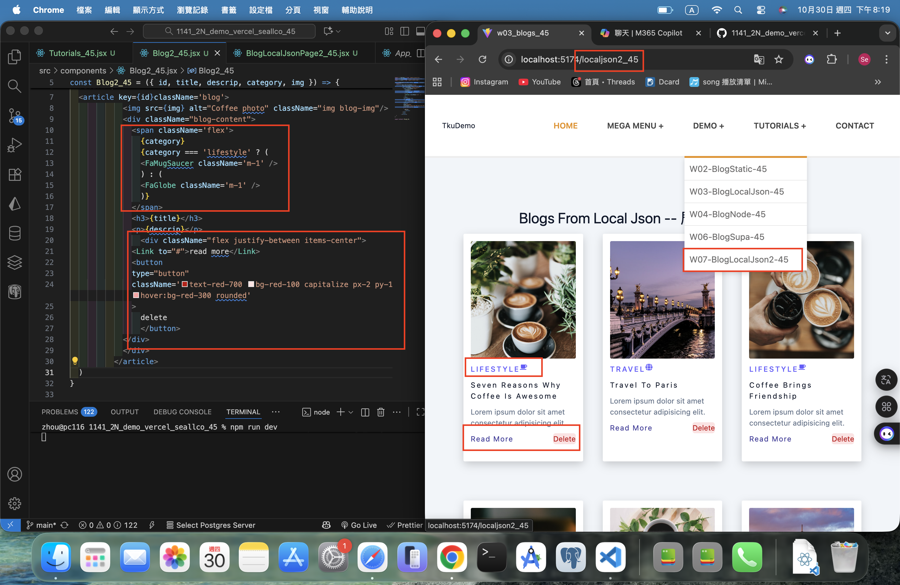
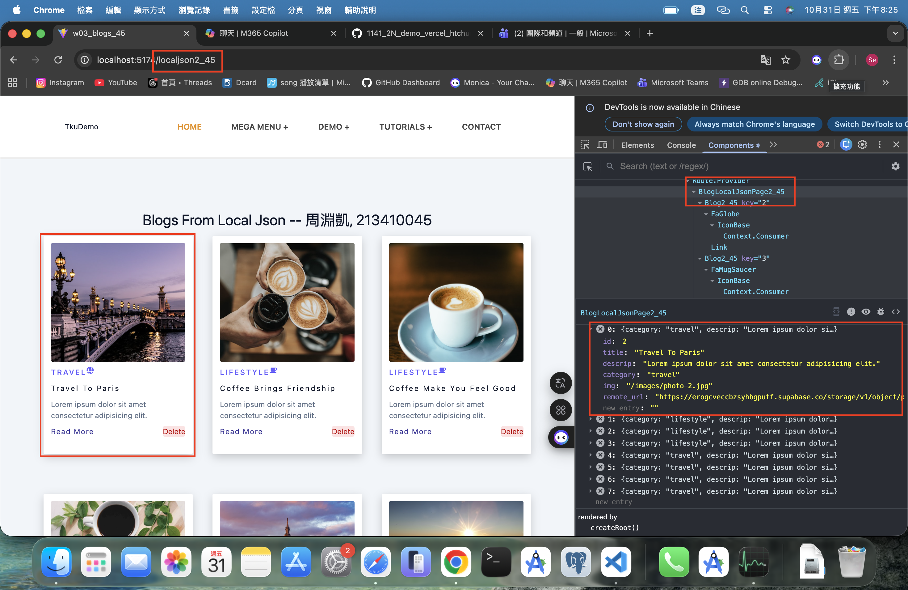
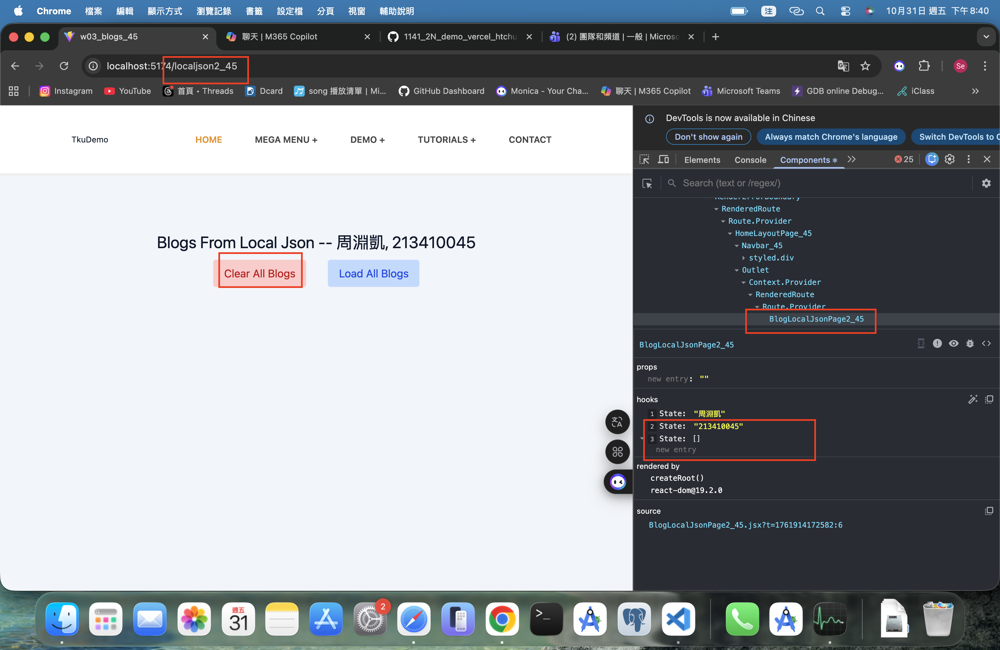
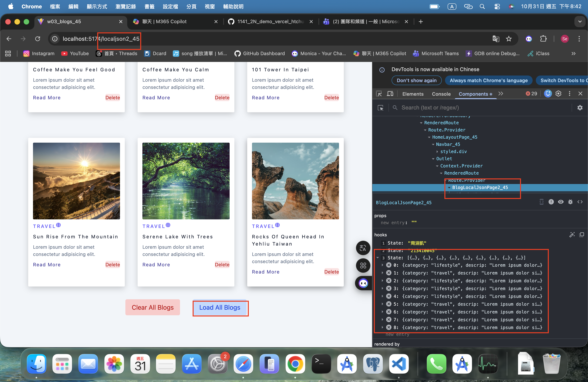
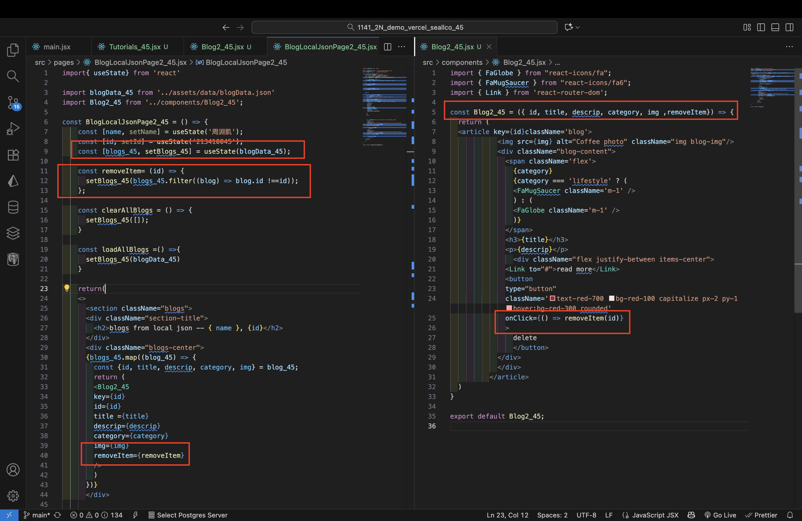
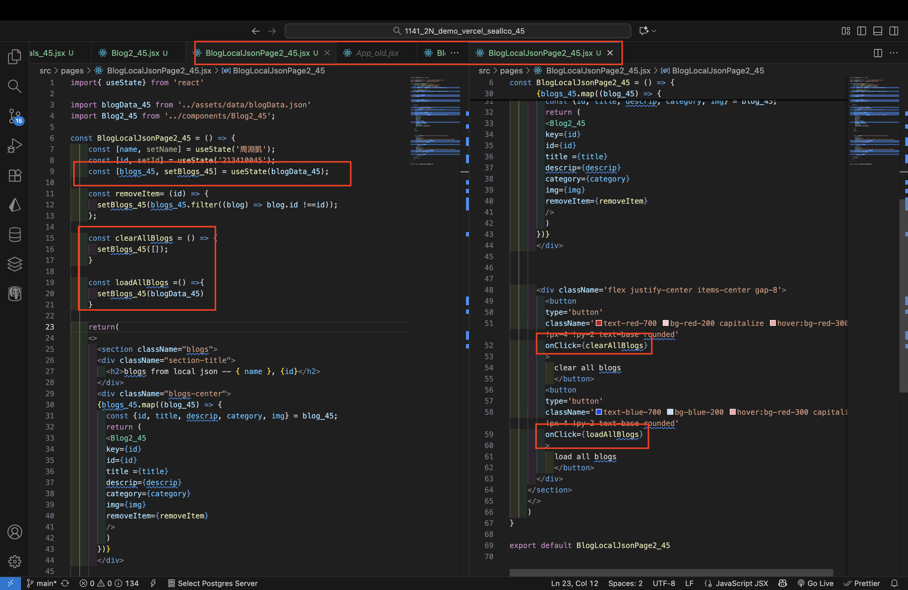
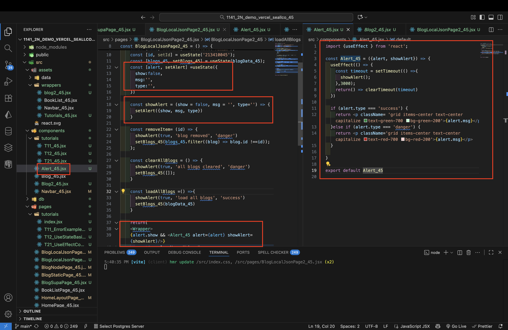

[Github URL](https://github.com/seallco/1141-2N-demo-45.git)

### W07-P1: Use tailwind to style react icons and add a delete button
 

 
```
3d1dc73 seallco Thu Oct 30 20:22:28 2025 +0800  WW07-P1: Use tailwind to style react icons and add a delete button
```

### W07-P2: Implement delete a blog, clear all blogs, load all blogs
 
#### => delete first blog
 

 
#### => clear all blogs
 

 
#### => load all blogs
 

 
#### => code for deleting a blog
 

 
#### => code for clear and load all blogs
 

 
```
c7f310e seallco Fri Oct 31 20:49:14 2025 +0800  W07-P2: Implement delete a blog, clear all blogs, load all blogs
```

### W07-P3: Implement Alert_45
 
#### => code for Alert_45
 

 
```
204429a seallco Sat Nov 1 17:45:16 2025 +0800   W07-P3: Implement Alert_45
```
