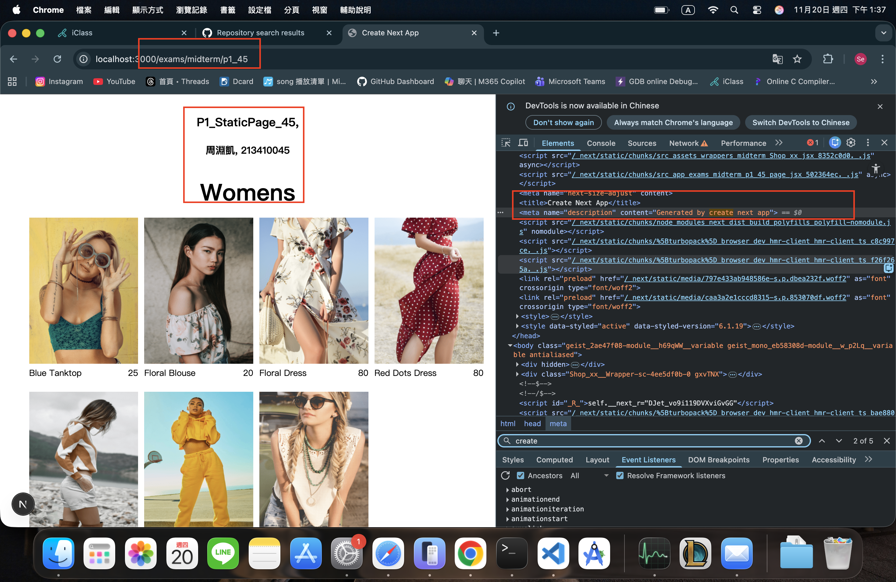
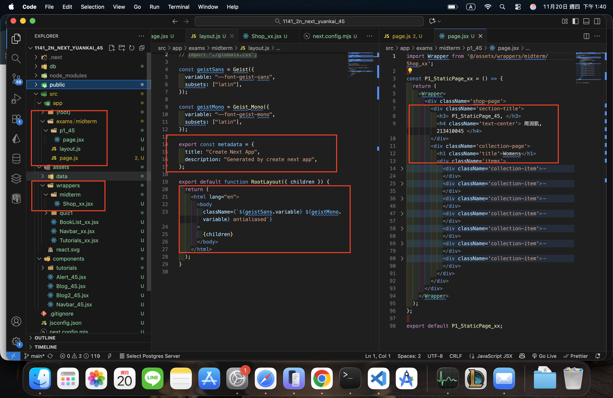
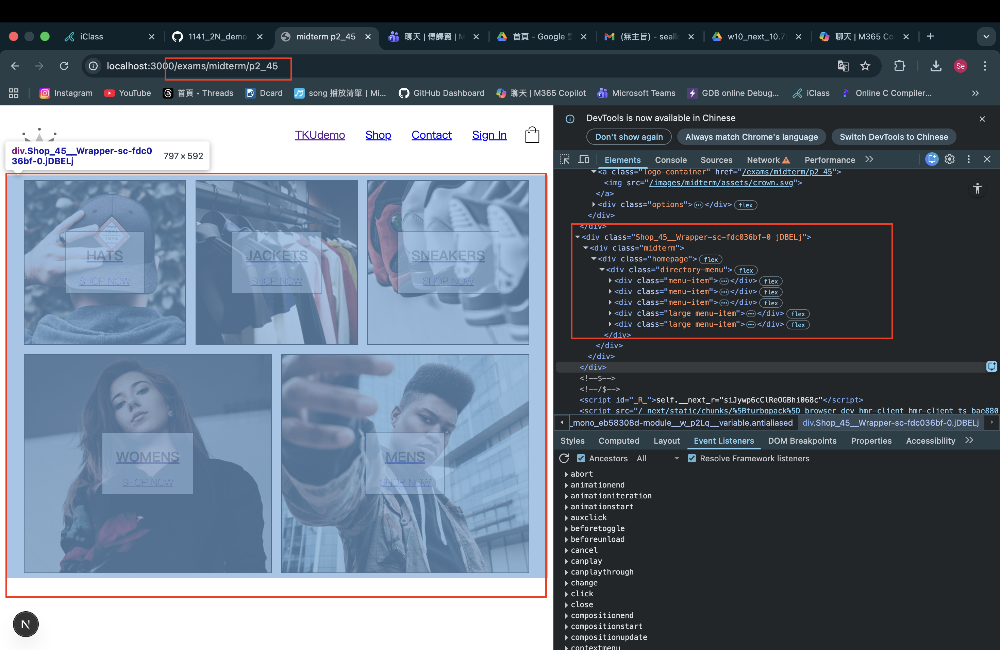
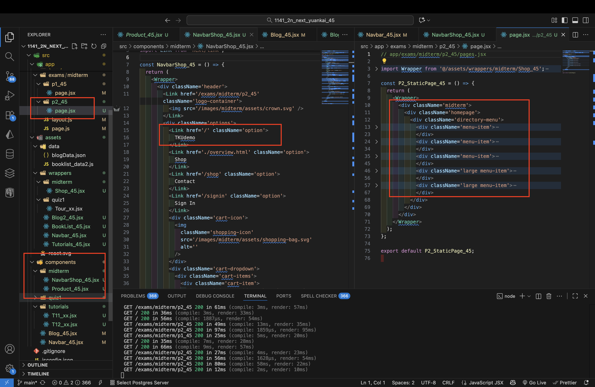
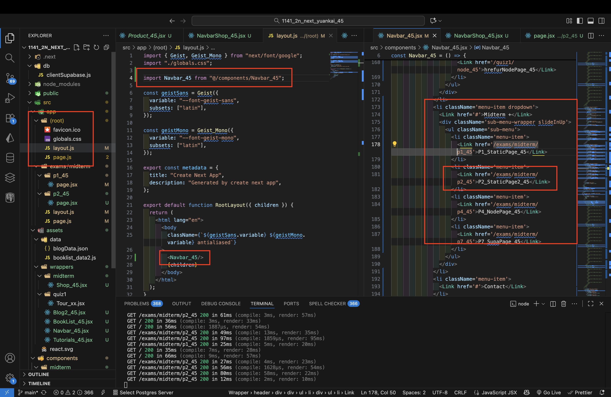

[Github URL](https://github.com/seallco/1141-2N-demo-45.git)

### W10-P1: implement /exams/midterm/p1_45 for P1 in mid-1
 
##### => Chrome, show P1 page with meta data
 

 
##### => show the relevant code
 

 
```
dcc05d6 seallco Thu Nov 20 13:44:14 2025 +0800  W10-P1: implement /exams/midterm/p1_45 for P1 in mid-1
```
### W10-P2: Implement /exams/miderm/p2_45 for P2 in mid-1
 
#### => shown in Chrome
 

 
#### => the relevant code for P2
 

 
#### => Navbar_45 for root layout
 

 
```
376b9dd seallco Sun Nov 23 14:49:00 2025 +0800  W10-P2: Implement /exams/miderm/p2_45 for P2 in mid-1
```

