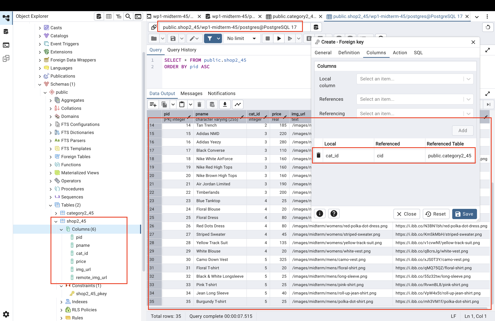
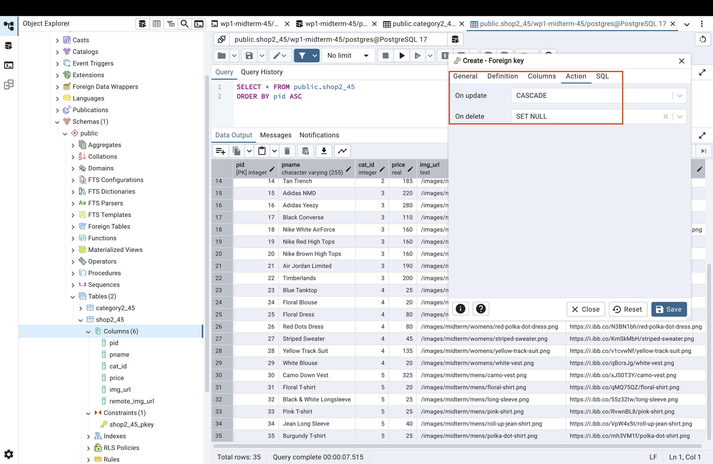
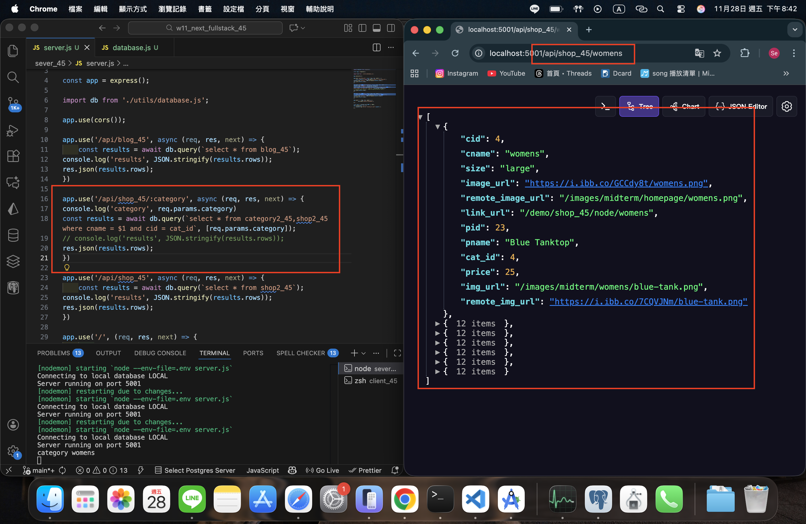
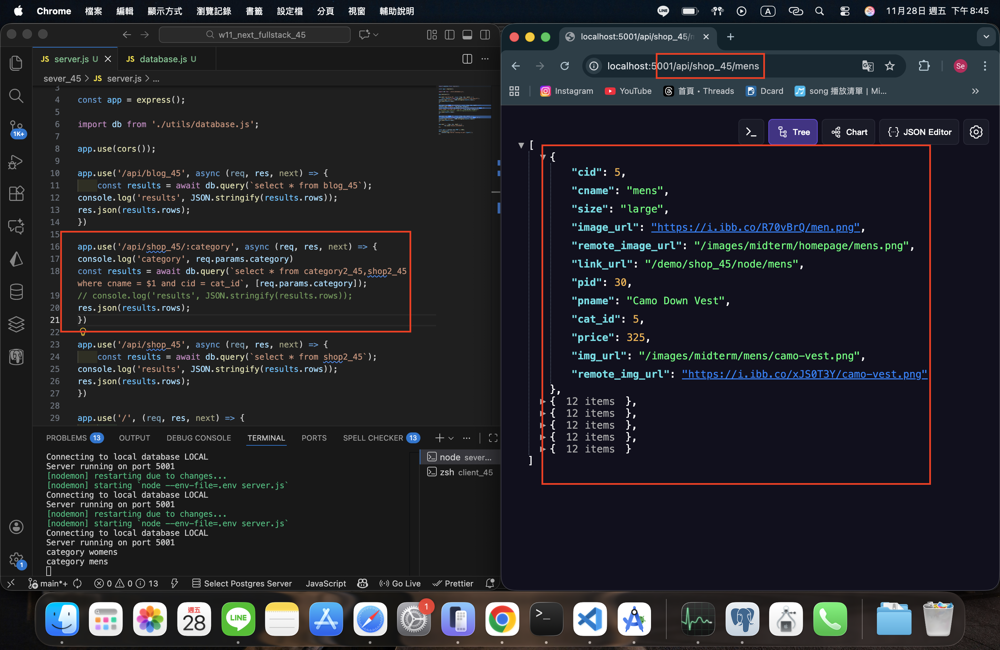
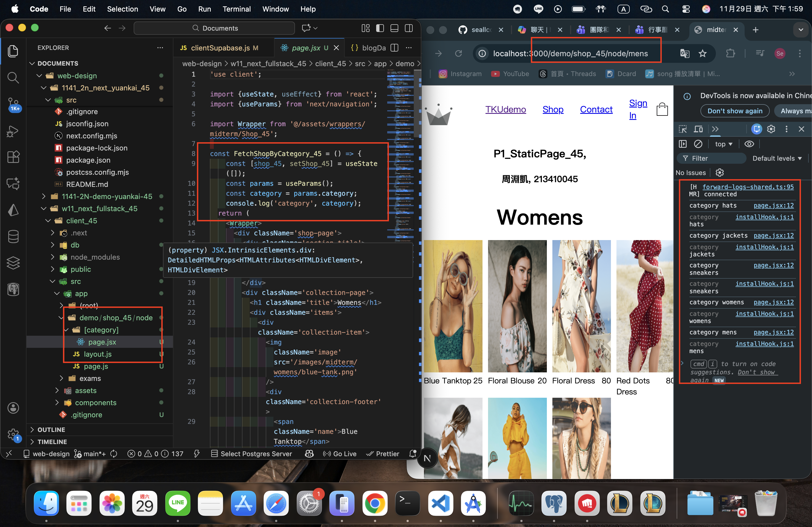
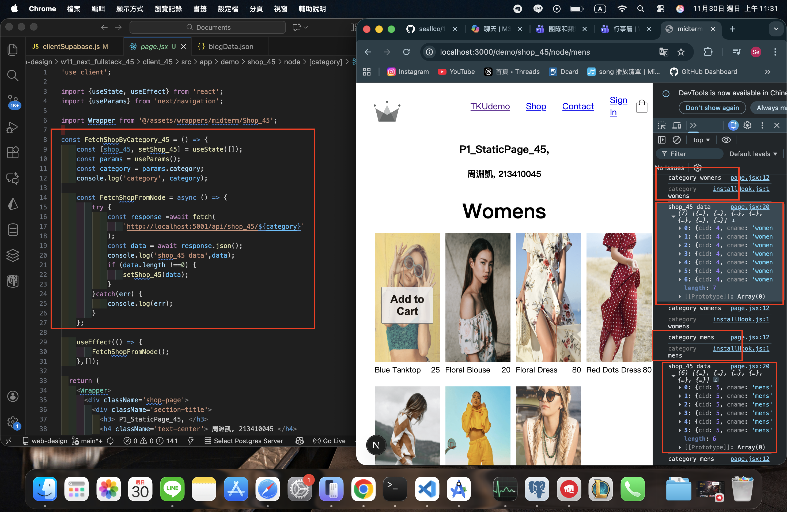
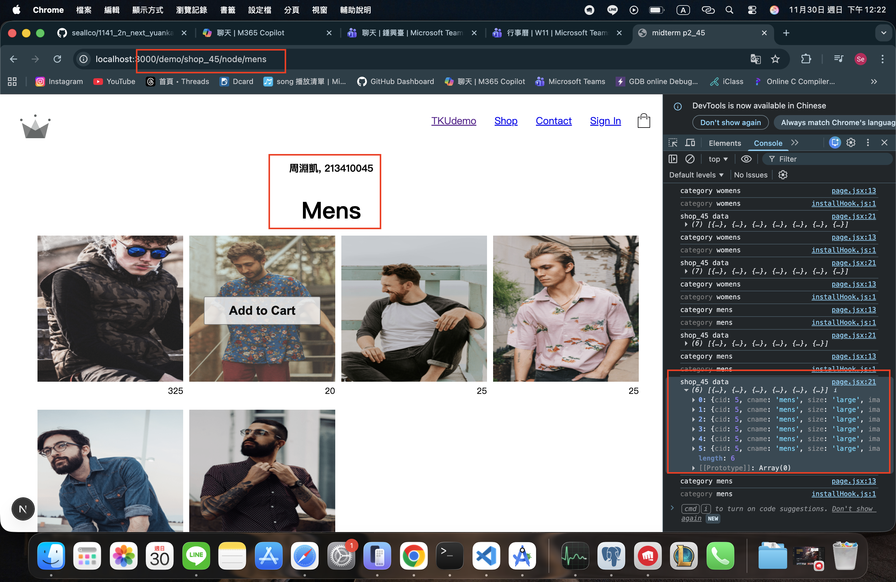
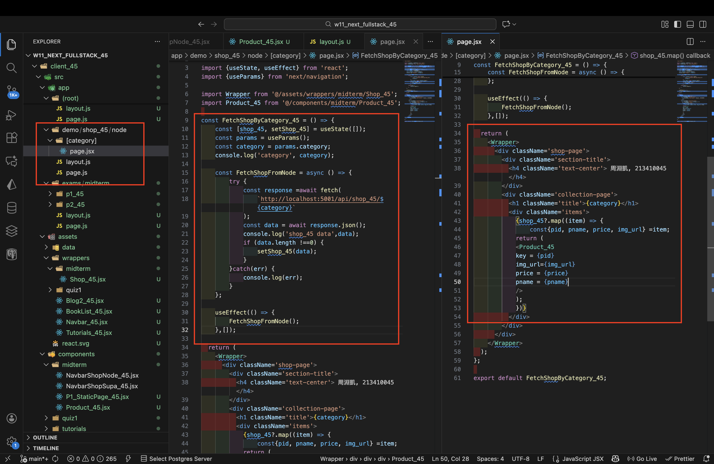

[Github URL](https://github.com/seallco/1141-2N-demo-45.git)\
[Github URL for Vercel](https://github.com/seallco/1141_2N_demo_vercel_seallco_45)\
[Vercel URL](https://1141-2-n-demo-vercel-seallco-45.vercel.app/)\
[Gitbub Next URL](https://github.com/seallco/1141_2n_next_yuankai_45)\
[Vercel Next URL](https://1141-2n-next-yuankai-45.vercel.app/)\


### W11-P1: Implement route /api/shop_45/:category in server
 
##### => create tables category2_45 and shop2_45 using SQL and set foreign key of cat_id referencing to cid in category2_45
 

 
##### => update and delete constraints of the foreign key
 

 
##### => Chrome, show /api/shop_45/womens with code (you need to use last two digits of your id)
 

 
##### => Chrome, show /api/shop_45/mens with code (you need to use last two digits of your id)
 

 
```
f81541 seallco Sun Nov 30 12:39:27 2025 +0800  W11-P1: Implement route /api/shop_45/:category in server
```

### W11-P2: Implement /demo/shop_45/node and /demo/shop/node/:category in client
 
#### => show how to get category from params
 

 
#### => show how to fetch category from the category main page
 

 
#### => Chrome, show FetchShopByCategory_45.jsx by click Mens
 

 
#### => relevant code for FetchShopByCategory_45
 

 
```
W11-P2: Implement /demo/shop_45/node and /demo/shop/node/:category in client
```

