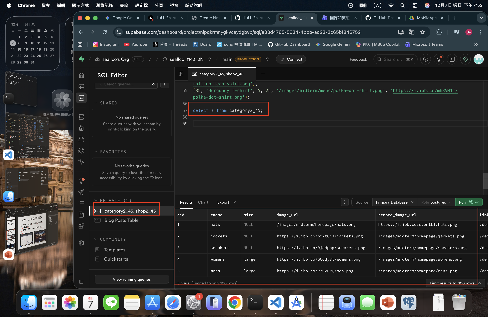
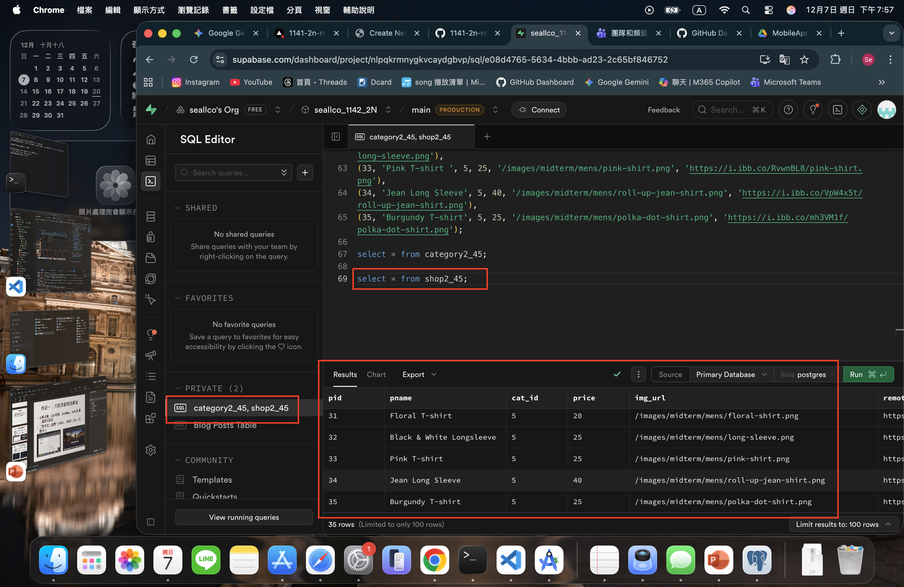
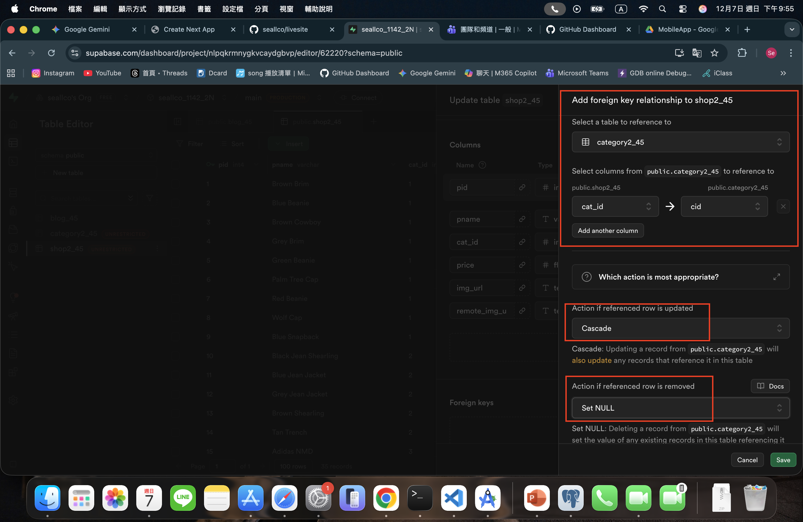
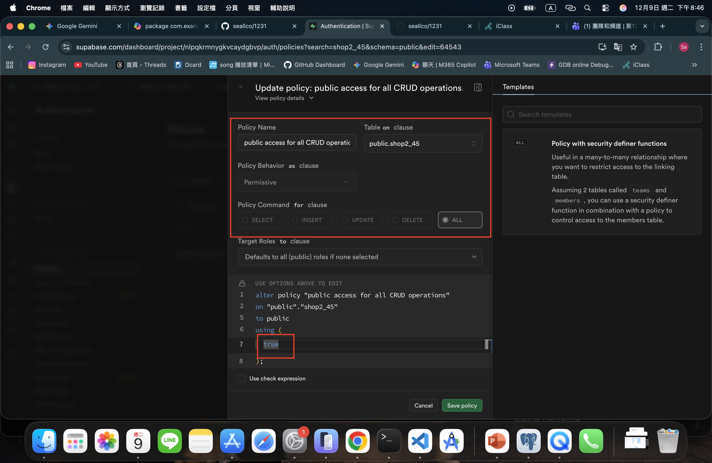
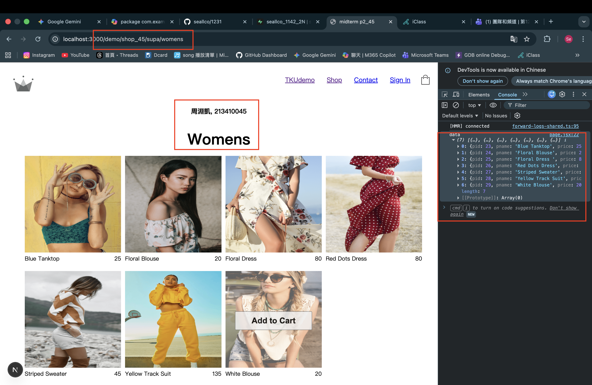
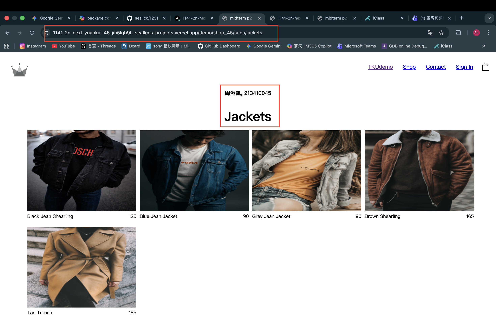

[Github URL](https://github.com/seallco/1141-2N-demo-45.git)\
[Github URL for Vercel](https://github.com/seallco/1141_2N_demo_vercel_seallco_45)\
[Vercel URL](https://1141-2-n-demo-vercel-seallco-45.vercel.app/)\


### W12-P1: Refine code of /demo/shop_45/node
 

 
```
23d5c71 seallco Sat Dec 6 11:49:26 2025 +0800   W12-P1: Refine code of /demo/shop_45/node
```

### W12-P2: Deploy code to Vercel
 
#### => npm run build
 

 
#### => npm start
 

 
#### => Vercel, add environment variables
 

 
#### => Vercel homepage success
 

 
#### => Github repo and Vercel URL
 
[Gitbub Next URL](https://github.com/seallco/1141-2n-next-yuankai_45)\
[Vercel Next URL](https://1141-2n-next-yuankai-45.vercel.app/)


 
#### => Share to teacher and TA
 
htchung@gms.tku.edu.tw
sian-0018
 

 
```
6d0b332 seallco Tue Dec 9 22:21:34 2025 +0800   W12-P2: Deploy code to Vercel
```

### w12-P3: Implenment /demo/shop2_45/supabase to fetch products from Supabase
 
#### => use SQL to get category2_45 data
 

 
#### => use SQL to get shop2_45 data
 

 
#### => set foreign key
 

 
#### => set RLS policies for public access for all CRUD
 

 
#### => Chrome -- local
 

 
#### => Chrome -- Vercel
 

 
```
c38b304 seallco Tue Dec 9 22:23:10 2025 +0800   w12-P3: Implenment /demo/shop2_45/supabase to fetch products from Supabase
```