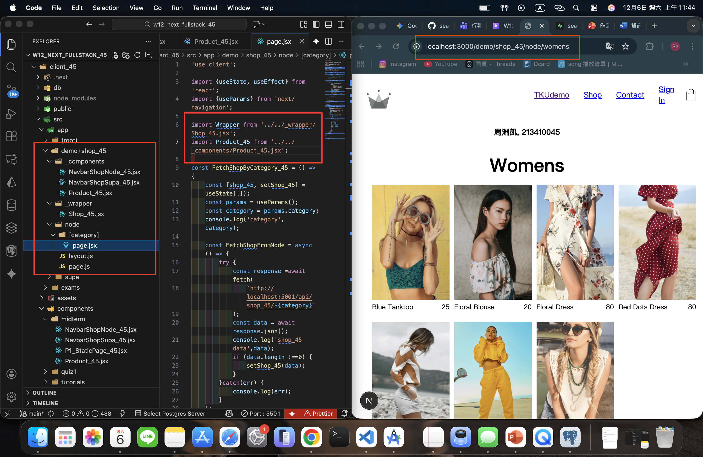
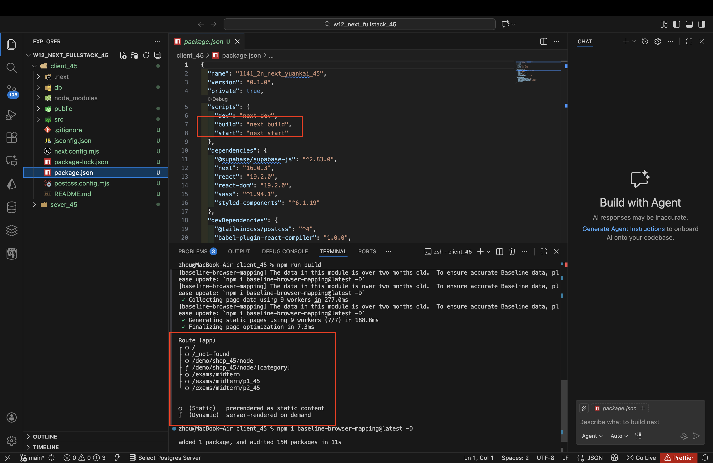
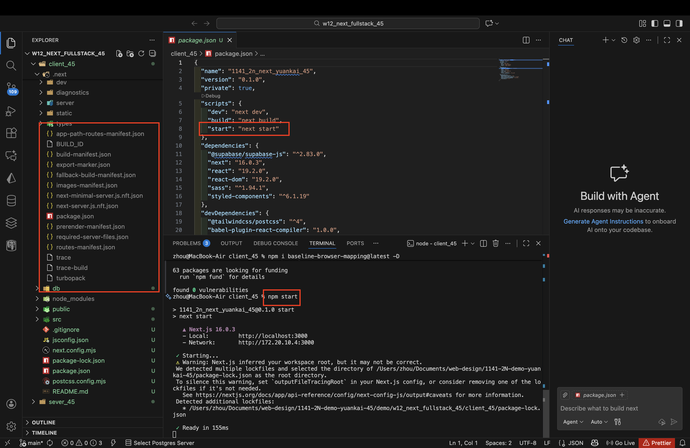
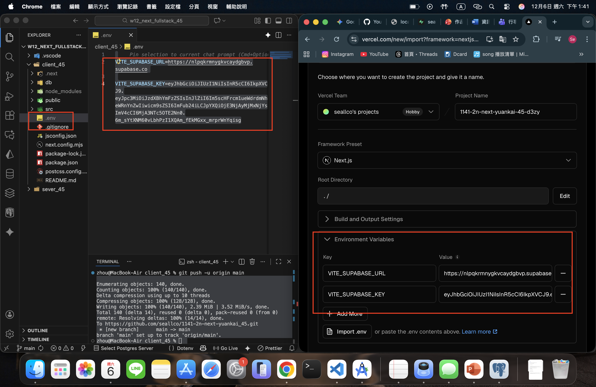
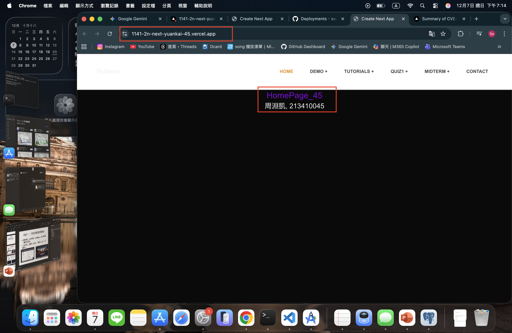
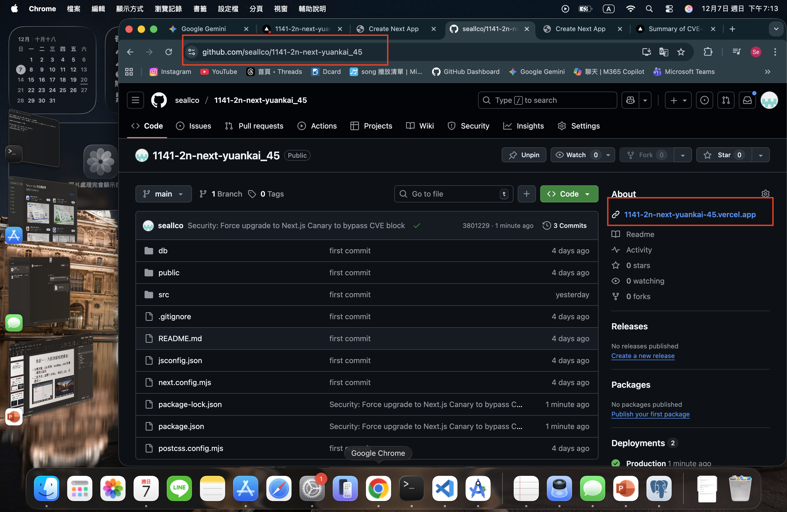
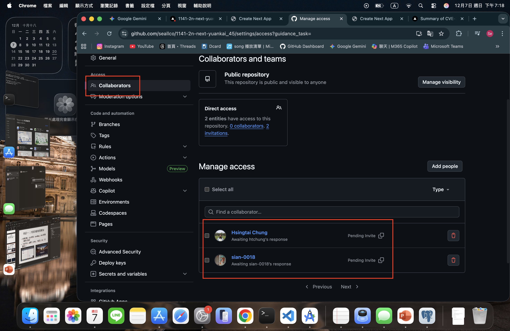

[Github URL](https://github.com/seallco/1141-2N-demo-45.git)\
[Github URL for Vercel](https://github.com/seallco/1141_2N_demo_vercel_seallco_45)\
[Vercel URL](https://1141-2-n-demo-vercel-seallco-45.vercel.app/)\


### W12-P1: Refine code of /demo/shop_45/node
 

 
```
23d5c71 seallco Sat Dec 6 11:49:26 2025 +0800   W12-P1: Refine code of /demo/shop_45/node
```

### W12-P2: Deploy code to Vercel
 
#### => npm run build
 

 
#### => npm start
 

 
#### => Vercel, add environment variables
 

 
#### => Vercel homepage success
 

 
#### => Github repo and Vercel URL
 
[Gitbub Next URL](https://github.com/seallco/1141-2n-next-yuankai_45)\
[Vercel Next URL](https://1141-2n-next-yuankai-45.vercel.app/)


 
#### => Share to teacher and TA
 
htchung@gms.tku.edu.tw
sian-0018
 

 
```
abc1a5f htchung Wed Dec 3 19:35:31 2025 +0800   W12-P2: Deploy code to Vercel
```

