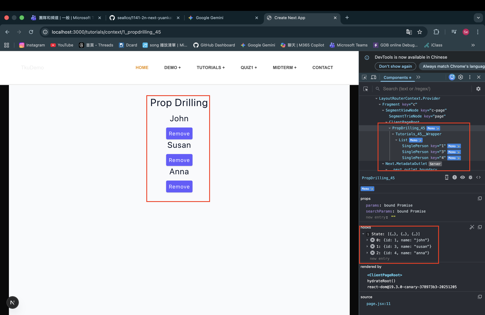
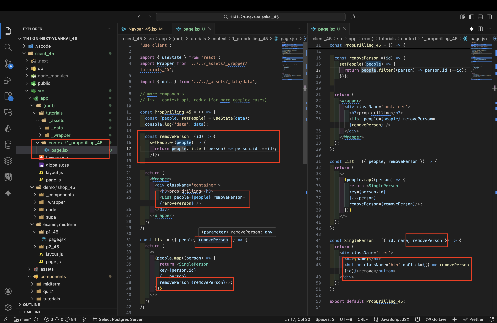

[Github URL](https://github.com/seallco/1141-2N-demo-45.git)\
[Github URL for Vercel](https://github.com/seallco/1141_2N_demo_vercel_seallco_45)\
[Vercel URL](https://1141-2-n-demo-vercel-seallco-45.vercel.app/)\
[Gitbub Next URL](https://github.com/seallco/1141_2n_next_yuankai_45)\
[Vercel Next URL](https://1141-2n-next-yuankai-45.vercel.app/)\


### W13-P1: Demo prop drilling
 
#### => Chrome, remove 4th person
 

 
#### => relevant code
 

 
```
c7c00fe htchung Wed Dec 10 19:09:55 2025 +0800  W13-P1: Demo prop drilling
```

### W11-P2: Implement /demo/shop_45/node and /demo/shop/node/:category in client
 
#### => show how to get category from params
 

 
#### => show how to fetch category from the category main page
 

 
#### => Chrome, show FetchShopByCategory_45.jsx by click Mens
 

 
#### => relevant code for FetchShopByCategory_45
 

 
```
W11-P2: Implement /demo/shop_45/node and /demo/shop/node/:category in client
```

