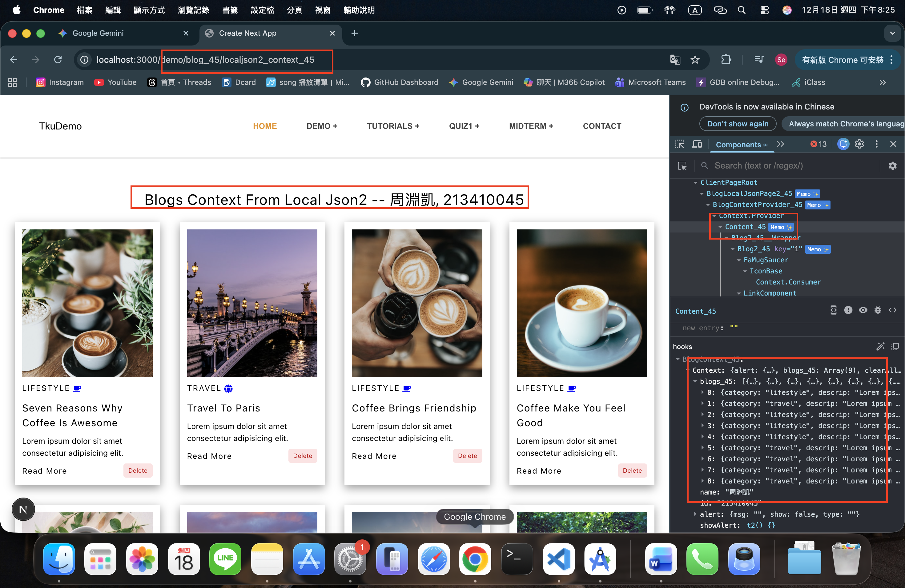
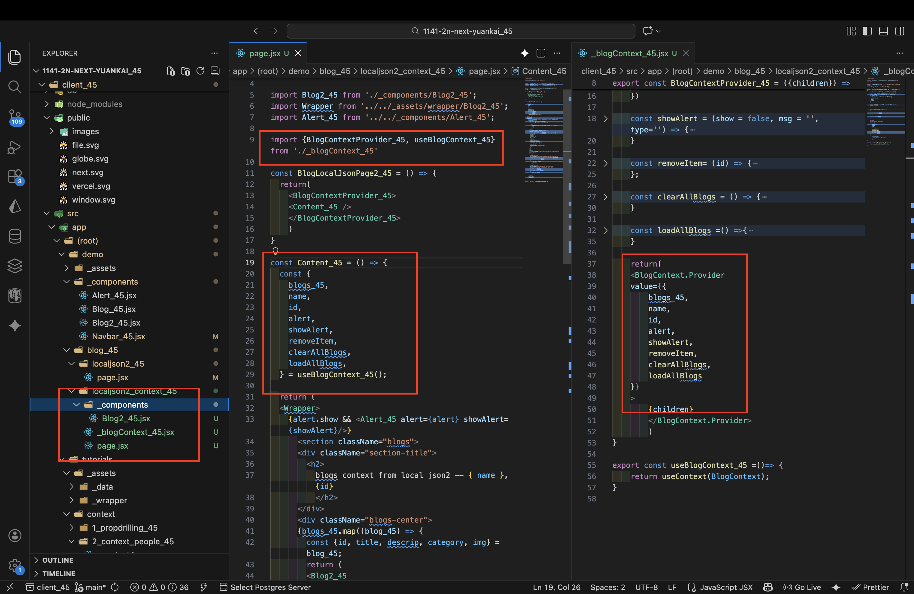
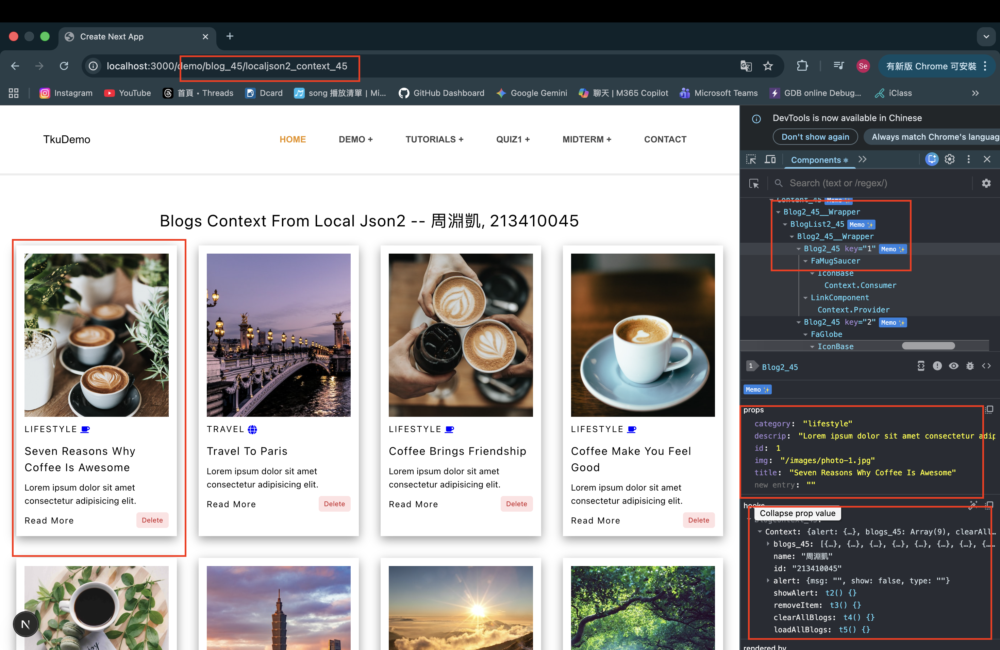
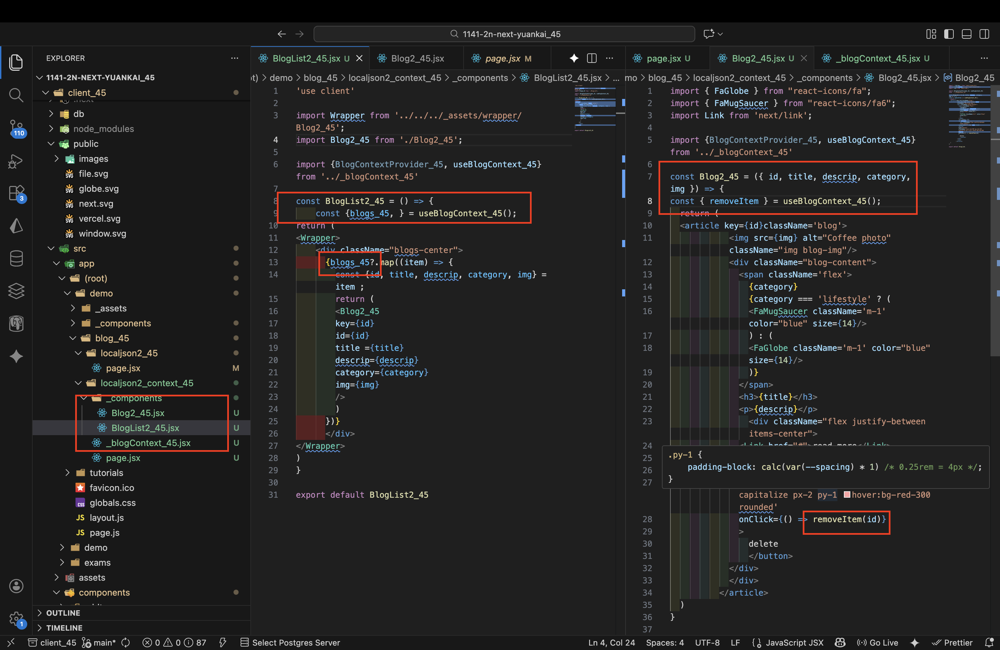

[Github URL](https://github.com/seallco/1141-2N-demo-45.git)\
[Github URL for Vercel](https://github.com/seallco/1141_2N_demo_vercel_seallco_45)\
[Vercel URL](https://1141-2-n-demo-vercel-seallco-45.vercel.app/)\
[Gitbub Next URL](https://github.com/seallco/1141_2n_next_yuankai_45)\
[Vercel Next URL](https://1141-2n-next-yuankai-45.vercel.app/)\


### W14-P1: Use Context for Blogs_45
 
#### => Chrome, show blogs_45 in Content component
 

 
#### => relevant code
 

 
```
d5ea28e seallco Thu Dec 18 20:32:43 2025 +0800  W14-P1: Use Context for Blogs_45
```

### W14-P2: Refine W14-P1 by using BlogList2_45
 
#### => Chrome, show BlogList2_45, Blog2_45 component
 

 
#### => relevant code
 

 
```
11dbf67 htchung Wed Dec 17 20:12:22 2025 +0800  W14-P2: Refine W14-P1 by using BlogList2_xx
```

### W13-P3: Move W7 BlogJson2 page to the route /demo/blog_45/localjson2_45
 
#### => Chrome, show the result
 

 
#### => relevant code
 

 
```
31ce045 seallco Fri Dec 12 20:48:38 2025 +0800  W13-P3: Move W7 BlogJson2 page to the route /demo/blog_xx/localjson2_45
```
 