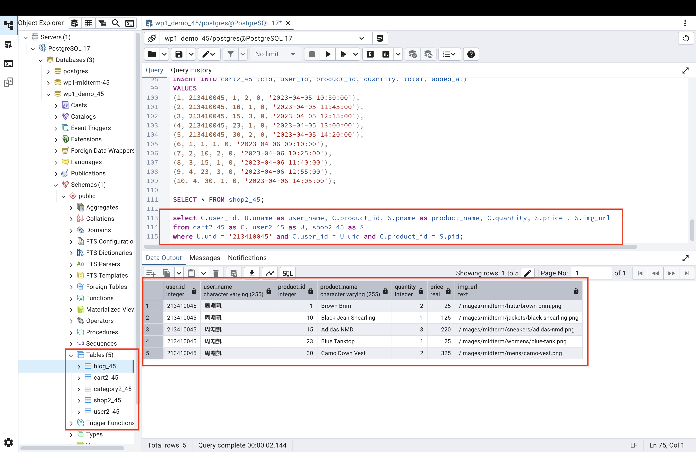
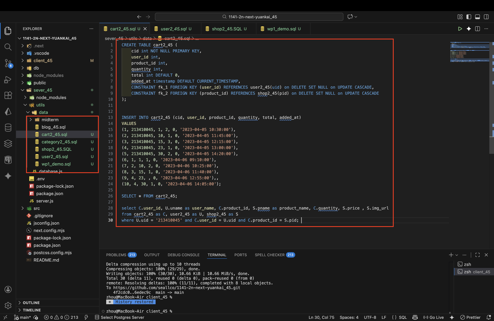

[Github URL](https://github.com/seallco/1141-2N-demo-45.git)\
[Github URL for Vercel](https://github.com/seallco/1141_2N_demo_vercel_seallco_45)\
[Vercel URL](https://1141-2-n-demo-vercel-seallco-45.vercel.app/)\
[Gitbub Next URL](https://github.com/seallco/1141_2n_next_yuankai_45)\
[Vercel Next URL](https://1141-2n-next-yuankai-45.vercel.app/)\


### W15-P1: Create tables category2_45, shop2_45, user2_45, cart2_45, and put 5 products into a cart for the user of your id
 
#### => pgAdmin4, show SQL command to get the needed info
 

 
#### => sql code
 

 
```
e5d5b14 seallco Sun Dec 28 13:33:11 2025 +0800  W15-P1: Create tables category2_45, shop2_45, user2_45, cart2_45, and put 5 products into a cart for the user of your id
```

### W14-P2: Refine W14-P1 by using BlogList2_45
 
#### => Chrome, show BlogList2_45, Blog2_45 component
 

 
#### => relevant code


 
```
11dbf67 htchung Wed Dec 17 20:12:22 2025 +0800  W14-P2: Refine W14-P1 by using BlogList2_xx
```

### W14-P3: Implement /demo/grocery_45 for Grocery_45
 
#### => Chrome, add two data, and shown in components
 

 
#### => relevant code
 

 
```
c8b99fa seallco Fri Dec 19 21:18:25 2025 +0800  W14-P3: Implement /demo/grocery_45 for Grocery_45
```
 